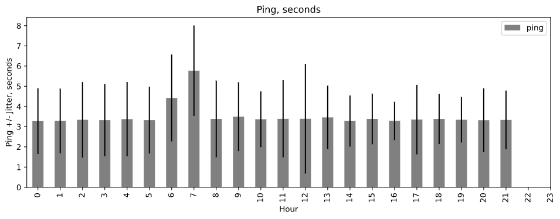

# Automate ookla speedtest
With `test.ps1` PowerShell script you can easily use Ookla Speedtest® CLI to measure internet connection performance metrics like download, upload, latency and packet loss natively without relying on a web browser.

* run scheduled internet speed tests
* set up test intervals and duration
* analyze raw test data 

## How to get started and automatically measure the internet speed
1. Download this repository to your PC.
2. Download Speedtest CLI from [here](https://www.speedtest.net/apps/cli) and unpack `speedtest.exe` file in the repository folder.
3. Run `speedtest.exe` manually to accept the license (required only once). 
4. Open PowerShell in your terminal in this folder and type `.\test`
5. Test results will be saved in `internetspeed.json` as specified in `test.ps1`.

Additionally you can output to CSV but with less options, by running  `.\test-csv`

## Visualized test data

Boxplot


Density distribution
 

Speed and ping based on the hour of the day
 
 

## Options
Options from `test.ps1`
```powershell
$outputfile = ".\internetspeed.json" #JSON file where the test results are stored

$testduration = 14 #in days

$interval = 1 #wait and restart after $interval seconds

$numberoftests = $testduration*24*60*60/$interval #calculated based on $testduration and the $interval
```
Additionally you can collect directly to CSV but with less options

## Analysis
After you have collected data in the JSON format, you can analyze it in your favorite software or using the script already written.
1. Verify `internetspeed.json` has UTF8 encoding (without BOM);
2. Open and run `main.ipynb` in Python 3/Jupyter environment to display your stats.
## Output
Here's the sample output you'd receive for each test in JSON.
```JSON
{
    "type": "result",
    "timestamp": "2021-02-03T22:25:46Z",
    "ping": {
        "jitter": 0.20899999999999999,
        "latency": 3.214
    },
    "download": {
        "bandwidth": 10941393,
        "bytes": 39562829,
        "elapsed": 3608
    },
    "upload": {
        "bandwidth": 11838684,
        "bytes": 42652051,
        "elapsed": 3605
    },
    "packetLoss": 0,
    "isp": "XXX",
    "interface": {
        "internalIp": "X.X.X.X",
        "name": "",
        "macAddr": "X:X:X:X:X:X",
        "isVpn": false,
        "externalIp": "X.X.X.X"
    },
    "server": {
        "id": "X",
        "name": "X",
        "location": "X",
        "country": "X",
        "host": "X",
        "port": 8080,
        "ip": "X.X.X.X"
    },
    "result": {
        "id": "X",
        "url": "https://www.speedtest.net/result/c/X"
    }
}

```

Here's the sample output you'd receive for each test in CSV.


## Prerequisites
* **Security Permissions**: You should have the rigth to launch scrips on your computer. To do this, use the cmdlet below. The `Set-ExecutionPolicy` cmdlet's default scope is `LocalMachine`, which affects everyone who uses the computer. To change the execution policy for `LocalMachine`, start PowerShell with Run as Administrator. Then type:
    ```powershell
    Set-ExecutionPolicy -ExecutionPolicy RemoteSigned -Scope LocalMachine
    Get-ExecutionPolicy -List
    ```
* **UTF8 encoding** for further analysis:
PowerShell 5.1 and 6 save in UTF8 with BOM Encoding, so you'd need to reconvert or install PowerShell 7+. To install, fire up PowerShell and copy/paste the following cmdlet into the window:
    ```powershell
    iex "& { $(irm https://aka.ms/install-powershell.ps1) } -UseMSI"
    ```
* **Python 3**
If you don't have python, you can set it up together with several other modules by installing [Anaconda3](https://www.anaconda.com/products/individual)


## How much Mbps is enough?

What is a good internet speed in Mbps? It depends on your usage (the data from [FCC](https://www.fcc.gov/consumers/guides/broadband-speed-guide)): 

| Activity                          	| Minimum download speed        |
|-----------------------------------	|-----------------------------	|
| Streaming SD music                	| <0.5Mbps                    	|
| Browsing, email, and social media 	| 1Mbps                       	|
| Streaming SD video                	| 3-4Mbps                     	|
| Streaming HD video                	| 5-8Mbps                     	|
| Streaming 4K video                	| 15-25Mbps                   	|
| Online multiplayer games          	| 4Mbps                       	|
| Video calls                       	| 6Mbps                       	|

### What does Mbps stand for?
The number in Megabits (Mbps) is how fast you’re downloading/uploading Megabytes (MB). 
* Mbps = Megabits per second, 1 Mb = 1000000 bits
* 1 Byte = 8 bits
* MBps = Megabytes per second, 1 MB = 1048576 Bytes


## Licenses

### License for the code and documentation for this repo
Feel free to modify this code as you wish, following the [MIT License](https://opensource.org/licenses/MIT).

Copyright 2021 Nikita Lukianets 

Permission is hereby granted, free of charge, to any person obtaining a copy of this software and associated documentation files (the "Software"), to deal in the Software without restriction, including without limitation the rights to use, copy, modify, merge, publish, distribute, sublicense, and/or sell copies of the Software, and to permit persons to whom the Software is furnished to do so, subject to the following conditions:

The above copyright notice and this permission notice shall be included in all copies or substantial portions of the Software.

THE SOFTWARE IS PROVIDED "AS IS", WITHOUT WARRANTY OF ANY KIND, EXPRESS OR IMPLIED, INCLUDING BUT NOT LIMITED TO THE WARRANTIES OF MERCHANTABILITY, FITNESS FOR A PARTICULAR PURPOSE AND NONINFRINGEMENT. IN NO EVENT SHALL THE AUTHORS OR COPYRIGHT HOLDERS BE LIABLE FOR ANY CLAIM, DAMAGES OR OTHER LIABILITY, WHETHER IN AN ACTION OF CONTRACT, TORT OR OTHERWISE, ARISING FROM, OUT OF OR IN CONNECTION WITH THE SOFTWARE OR THE USE OR OTHER DEALINGS IN THE SOFTWARE.


### Terms of Use and Privacy Policy Notices for speedtest.exe as of 2021-02-06
You may only use this Speedtest software and information generated from it for personal, non-commercial use,
through a command line interface on a personal computer.  Your use of this software is subject to the End User
License Agreement, Terms of Use and Privacy Policy at these URLs:

* [https://www.speedtest.net/about/eula](https://www.speedtest.net/about/eula)
* [https://www.speedtest.net/about/terms](https://www.speedtest.net/about/terms)
* [https://www.speedtest.net/about/privacy](https://www.speedtest.net/about/privacy)
