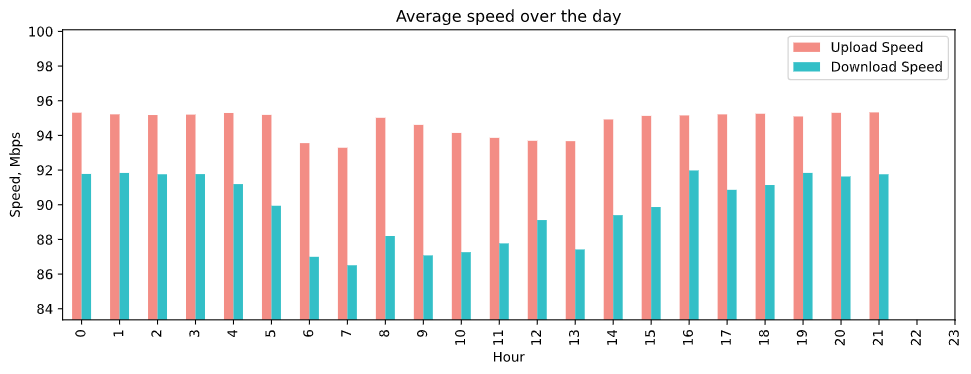

# Automate ookla speedtest
With `test.ps1` PowerShell script you can easily use Ookla Speedtest® CLI to measure internet connection performance metrics like download, upload, latency and packet loss natively without relying on a web browser.

* run scheduled internet speed tests
* set up test intervals and duration
* analyze raw test data 

## Visualized test data

Boxplot


Density distribution
 

Speed and ping based on the hour of the day
 
 


## How to het started and automatically measure the internet speed
1. Download this repository to your PC.
2. Download Speedtest CLI from [here](https://www.speedtest.net/apps/cli) and unpack `speedtest.exe` file in the repository folder.
3. Open PowerShell in your terminal in this folder and type `.\test`
4. Test results will be saved in `internetspeed.json` as specified in `test.ps1`.

Additionally you can output to CSV but with less options, by running  `.\test-csv`

## Options
Options from `test.ps1`
```powershell
$outputfile = ".\internetspeed.json" #JSON file where the test results are stored

$testduration = 14 #in days

$interval = 1 #wait and restart after $interval seconds

$numberoftests = $testduration*24*60*60/$interval #calculated based on $testduration and the $interval
```
Additionally you can collect directly to CSV but with less options
## Output
Here's the sample output you'd receive for each test in JSON.
```JSON
{
    "type": "result",
    "timestamp": "2021-02-03T22:25:46Z",
    "ping": {
        "jitter": 0.20899999999999999,
        "latency": 3.214
    },
    "download": {
        "bandwidth": 10941393,
        "bytes": 39562829,
        "elapsed": 3608
    },
    "upload": {
        "bandwidth": 11838684,
        "bytes": 42652051,
        "elapsed": 3605
    },
    "packetLoss": 0,
    "isp": "XXX",
    "interface": {
        "internalIp": "X.X.X.X",
        "name": "",
        "macAddr": "X:X:X:X:X:X",
        "isVpn": false,
        "externalIp": "X.X.X.X"
    },
    "server": {
        "id": "X",
        "name": "X",
        "location": "X",
        "country": "X",
        "host": "X",
        "port": 8080,
        "ip": "X.X.X.X"
    },
    "result": {
        "id": "X",
        "url": "https://www.speedtest.net/result/c/X"
    }
}

```

Here's the sample output you'd receive for each test in CSV.


## Prerequisites
* **Security Permissions**: You should have the rigth to launch scrips on your computer. To do this, use the cmdlet below. The `Set-ExecutionPolicy` cmdlet's default scope is `LocalMachine`, which affects everyone who uses the computer. To change the execution policy for `LocalMachine`, start PowerShell with Run as Administrator. Then type:
    ```powershell
    Set-ExecutionPolicy -ExecutionPolicy RemoteSigned -Scope LocalMachine
    Get-ExecutionPolicy -List
    ```
* **UTF8 encoding** for further analysis:
PowerShell 5.1 and 6 save in UTF8 with BOM Encoding, so you'd need to reconvert or install PowerShell 7+. To install, fire up PowerShell and copy/paste the following cmdlet into the window:
    ```powershell
    iex "& { $(irm https://aka.ms/install-powershell.ps1) } -UseMSI"
    ```

## Analysis
1. Verify `internetspeed.json` has UTF8 encoding (without BOM);
2. Open and run `main.ipynb` in Python 3/Jupyter environment to display your stats.